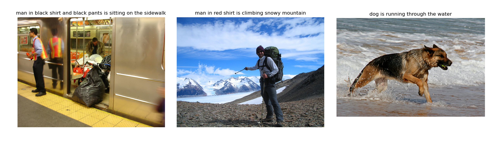

# Deep Neural Captioning Model

## The Task
The task is to automatically generate captions for images.  

- Input: Image
- Output: Text

## The Result

As can be seen, the results aren't perfect, from funny (left image), close (middle image), to not bad (right image) 😄. There is a lot of room for improvement.

## About

### Context
The goal of image captioning is to obtain a description of an image. This is easy for us humans, but it is difficult for machines because it not only requires the understanding of the image, but also the compilation of that understanding into natural language.

### The Data
The data used is originally from the Department of Computer Science at the University of Illinois at Urbana-Champaign. The data can be downloaded from \[[1](#sources)\]. 

Since this is image captioning, there are two sets of data: image data and text data:
- **Images**: As will be explained in more detail below, a pretrained VGG16 model will be used to extract features at the start of the neural captioning model. However, VGG is a large model, and so to make training faster and use less memory, the features will be computed beforehand. This precomputation would remove the need to run VGG everytime the image is used.
- **Text**: Each labelled image would have its corresponding caption text. For the model to work with text, the text is encoded using a tokenizer, which maps texts to unique integer values.

### The Model
Two main tasks:
1. Extract features from the image
2. Generate a sentence based on the features 

The above two tasks are accomplished with two models:

1. **Feature Extraction Model**: It is possible to train our own CNN to extract features, however that takes time and have risk of overfitting \[[2](#sources)\]. Instead, we can employ transfer learning, and used a pre-trained model. Specifically, we will use VGG16 model \[[3](#sources)\] provided by Keras \[[4](#sources)\] as the backbone to our neural captioning model. The last layer of the model, which is originally used for image classification, is removed. The backbone thus takes in a 224x224x3 image and outputs a 1x4096 vector of features.

2. **Language Model**: This will be a model that is trained to generate sequence of words based on both the image features and the words that are already generated. Since we're dealing with sequences, it is advantageous to use recurrent neural networks. In this repo, we will be using Long Short-Term Memory (LSTM) networks.

Image is fed into feature extraction model, text is fed into the language model, and then the outputs of each are combined and fed through dense layers.

## Running the code
1. Download and unzip the image dataset from \[[5](#sources)\] and corresponding text dataset from \[[6](#sources)\].
1. In config.py, set `image_dir` to be the path to the image dataset folder and `raw_descriptions_file_path` as the path to the Flickr8k.token.txt file inside the text dataset. 
1. Run data_preparation.py to a text file of processed descriptions and a pickle file of VGG features generated from the images, both files in a data folder.
1. Run train.py to train.
1. Run test.py to test OR Run model.py to quickly test (but first specify the model you want to test and include images you want to test).

## Possible Improvements
Although the model that is presented here is not perfect, it did at least output valid text (even though at times it may not be describing the image at all). The following are some potential improvements that could be done:
- Using different pre-trained models with which to extract features. Here ,we used VGG16, but Keras also has other models \[[7](#sources)\] such as VGG19, ResNet50, and InceptionV3.
- Keep track of validation error to prevent overfitting
- Try out different hyperparameters

## Sources
\[1\] https://github.com/jbrownlee/Datasets/releases/tag/Flickr8k

\[2\] K. Xu, J. Ba, R. Kiros, K. Cho, A. Courville, R. Salakhutdinov, R. Zemel, Y. Bengio, "Attend and Tell: Neural Image Caption Generation with Visual Attention," _ArXiv_, vol. abs/1502.03044, 2016. 

\[3\] K. Simonyan and A. Zisserman, "Very Deep Convolutional Networks for Large-Scale
Image Recognition," _ArXiv_, vol. abs/1409.1556, 2015.

\[4\] https://keras.io/api/applications/vgg/

\[5\] https://github.com/jbrownlee/Datasets/releases/download/Flickr8k/Flickr8k_Dataset.zip

\[6\] https://github.com/jbrownlee/Datasets/releases/download/Flickr8k/Flickr8k_text.zip

\[7\] https://keras.io/api/applications/

