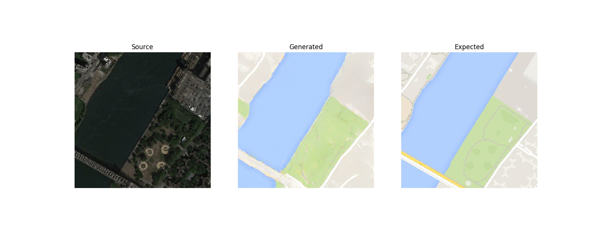

# cGAN
__Implementation of a conditional generative adverserial network (cGAN)__ to translate between satellite images and Google Maps images. This implementation was done as part of my undergraduate thesis in developing sim2real methods for urban search and rescue robots.

## The Task
The task is to translate between satellite images and Google Maps images. The data used is from \[[1](#sources)\].

For the initial investigation, I am translating from satellite to map images:

- Source: Satellite Image
- Target: Google Maps Image

- Image sizes: 256x256
- 1097 training images
- 1099 validation images

## The Result

## About the cGAN

### Context
A generative adversarial network (__GAN__) \[[2](#sources)\] consists of a generator and a discriminator, both being differentiable nonlinear functions (e.g. neural networks). While the generator aims to learn the distribution of the training data and generate new samples, the discriminator aims to predict the probability that a certain input was taken from the training set (i.e. real) rather than being generated by the generator (i.e. fake). The generator and discriminator are then trained simultaneously in a minimax game where the generator tries to fool the discriminator by generating realistic samples while the discriminator tries to distinguish between fake and real samples.

Conditional GANs (__cGAN__) \[[3](#sources)\] are GANs whose generator and discriminator are additionally conditioned with additional information. For example, the additional information can be an image. This is the case for __Pix2pix__ \[[4](#sources)\], which is a cGAN that is designed for performing image-to-image translation. Specifically, the Pix2pix generator takes an input source image and outputs a target image in another form (e.g. transforming gray images to colour images). 

For my undergraduate thesis, I looked into RCAN \[[5](#sources)\], which used a Pix2pix model for sim2real transfer in robotic manipulation. The work in this repository was used to test the idea of cGANs so that the insight from this investigation would inform my thesis.

### Bit more details
The cGAN consists of two main components - a PatchGAN discriminator and a U-Net generator. The __goal of the discriminator__ is to predict the probability that a certain image is a real translation of simulation images. As a PatchGAN \[[4](#sources)\] discriminator, each element of the output corresponds to a 70x70 patch of the input image and gives the probability that the corresponding patch is real. A benefit of using this is to allow for the model to be applicable to input images of various sizes. As a result, the model output depends on the size of the input. The __goal of the generator__ is to generate images based on source images. The generator is the portion of the cGAN that is ultimately used for translation during operation.

### Training
The discriminator and generator are trained using different losses. 

The discriminator loss is a binary cross entropy loss consisting of a component for the discriminator’s ability to detect samples from the training set and a component for the discriminator’s ability to detect samples that were generated by the generator. 

The generator loss is a weighted combination of an adversarial loss and L1 loss. The adversarial loss encourages the generation of images that were similar to images in the target domain while the L1 loss encourages the translation from source image to target image. A higher weighting for the L1 loss would encourage the generator to create plausible translations of the source image rather than just images in the target domain. The adversarial loss was implemented as a binary cross entropy loss that was based on the discriminator’s judgement on the generated images. The L1 loss was implemented as a mean absolute error between source image and generated image. 

#### Procedure
One epoch is one run through the batches. With batch size of 1 and 1097 training images, there will be 1097 iterations per epoch.

## Sources
\[[1] http://efrosgans.eecs.berkeley.edu/pix2pix/datasets/maps.tar.gz

\[[2] I. J. Goodfellow, J. Pouget-Abadie, M. Mirza, B. Xu, D. Warde-Farley,
S. Ozair, A. Courville, and Y. Bengio, “Generative adversarial nets,” in _Proceedings of the 27th International Conference on Neural Information Processing Systems - Volume 2_, NIPS’14, (Cambridge, MA, USA), p. 2672–2680, MIT Press, 2014.

\[[3] M. Mirza and S. Osindero, “Conditional generative adversarial nets,” _ArXiv_, vol. abs/1411.1784, 2014.

\[[4] P. Isola, J.-Y. Zhu, T. Zhou, and A. A. Efros, “Image-to-image translation with conditional adversarial networks,” _2017 IEEE Conference on Computer Vision and Pattern Recognition (CVPR)_, pp. 5967–5976, 2016.

\[[5] S. James, P. Wohlhart, M. Kalakrishnan, D. Kalashnikov, A. Irpan, J. Ibarz, S. Levine, R. Hadsell, and K. Bousmalis, “Sim-to-real via sim-to-sim: Dataefficient robotic grasping via randomized-to-canonical adaptation networks,” _2019 IEEE/CVF Conference on Computer Vision and Pattern Recognition (CVPR)_, pp. 12619–12629, 2018.
